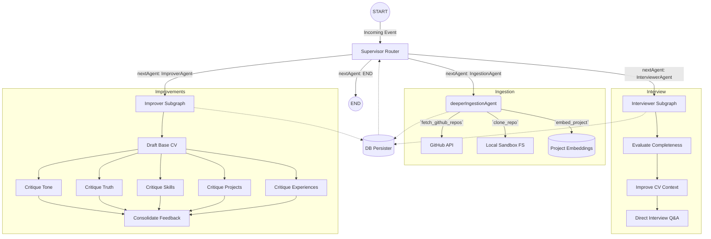

<div align="center">
  
</div>

# Main Curriculum — AI Workspace

Welcome to **Main Curriculum**, the command center for your professional AI workflow! This robust monolithic workspace provides all the necessary autonomous agents required to upgrade, tailor, and index your professional profile.

Built with modern architectures, this workspace powers autonomous interactions directly on your local machine using concurrent React environments and dynamic, graph-based agents.

## 🚀 Getting Started

Ensure you have **Node.js** (v18+) installed.

1. **Clone the repository:**
   Ensure you're working directly from `/home/lg/lab/maincurriculum`.
2. **Install all workspace dependencies:**
   ```bash
   npm install
   ```
3. **Set up your Environment:**
   Create `.env.local` or `.env` in the root and in the backend with your API key:
   ```env
   GEMINI_API_KEY="your_api_key_here"
   ```
4. **Boot both the Backend Engine & Frontend Interface:**
   ```bash
   npm run dev
   ```

## 🧩 Project Structure

This monorepo utilizes an NPM workspace configuration:

- **`packages/backend`**: The brains of the operation. Orchestrates agent context, handles local database integrations, and executes your workflow logic.
- **`packages/frontend`**: A state-of-the-art React workspace with breadcrumb-based navigation, responsive IDE-style layouts, and real-time synchronization with your underlying agents.

## 🧠 System Architecture

Main Curriculum orchestrates multiple autonomous AI subgraphs. The entire backend engine leverages a persistent state graph that coordinates complex pipelines.



## 🗂 Key Features

- **Job Tailor**: Instantly align your profile against specific job descriptions.
- **CV Improver**: An agentic pipeline that critiques and enhances your resume.
- **Vector Context Memory**: Persist details locally so your agents have enduring context.

> _Note: For immediate assistance and full context wiping, refer to the "Command Center" danger zone settings on your local dashboard._
