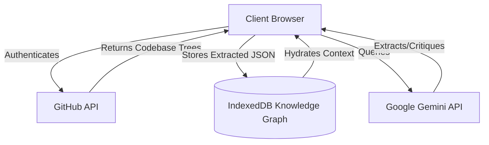
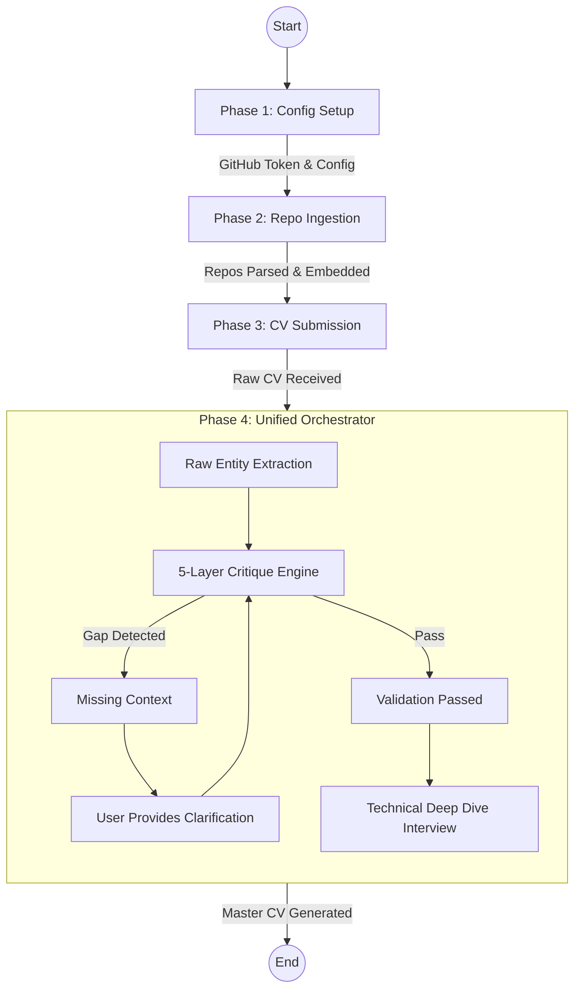
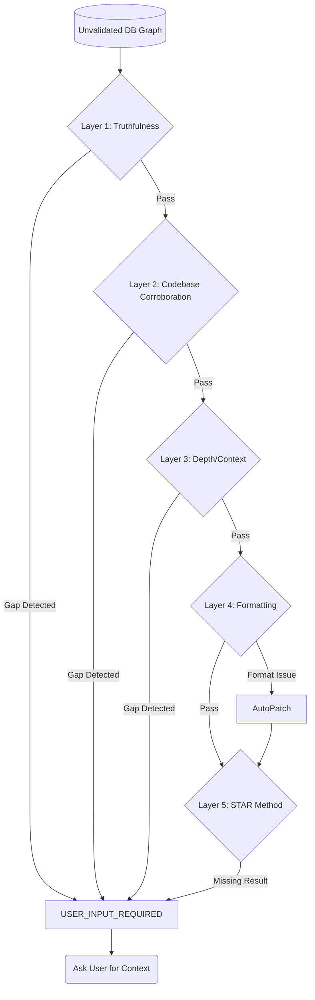
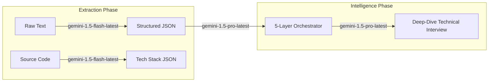
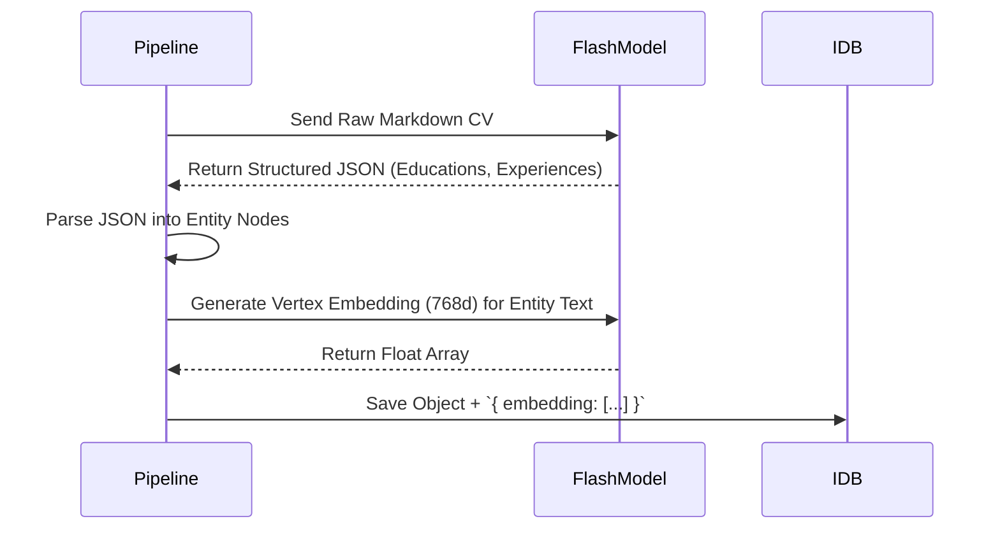
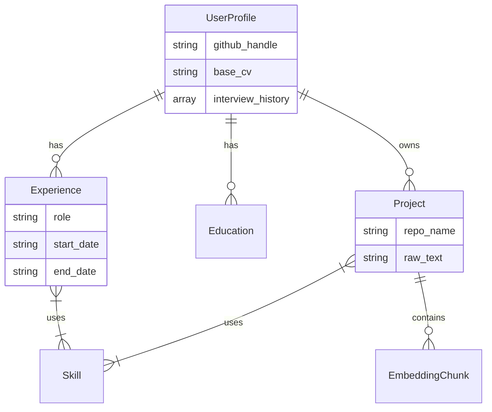
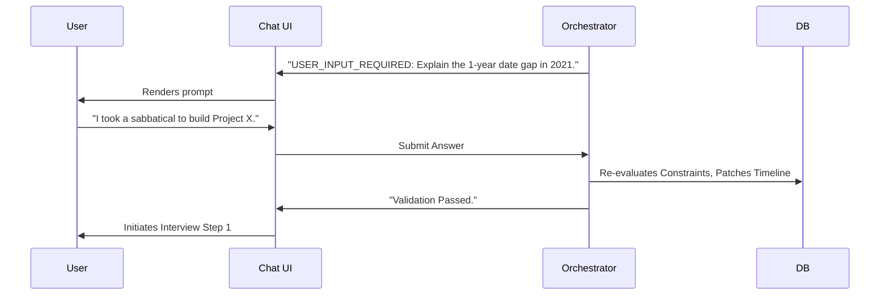
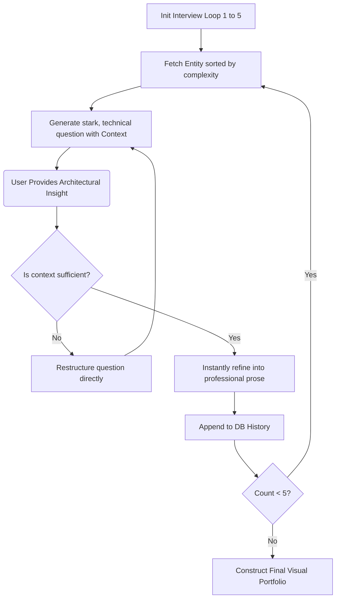
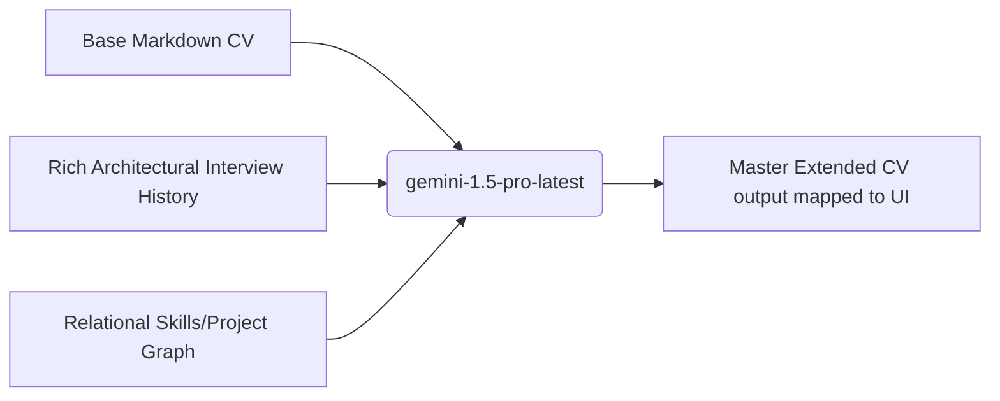

<div align="center">
  
</div>

# MainCurriculum - Autonomous AI Engineer Portfolio Orchestrator

MainCurriculum is an elite, intelligent, and autonomous AI-driven curriculum and portfolio generator. It acts as an orchestrator, securely ingesting your GitHub codebase and raw text CV to construct a highly localized semantic **Knowledge Graph** of your career. Through a rigorous 5-layer critique system and a deep-dive "Principal Engineer" style technical interview, it perfectly aligns your resume points to your actual codebase reality, producing a verifiable, highly technical Master CV.

## 🏗️ Architecture & Component Diagrams

To fully grasp the scale and implementation of MainCurriculum, review the 10 architecture diagrams below outlining the exact data flows, LLM utilization, and state orchestrations.

### 1. High-Level System Architecture

The foundational architecture blending the local client environment with remote intelligence.



### 2. Unified Orchestrator Pipeline Flow

The core user journey from initial configuration to the final Master Portfolio generation.



### 3. The 5-Layer Critique Engine

The defining feature of MainCurriculum. Before the AI accepts any CV claim, it validates it across five rigorous logical semantic layers.



### 4. LLM Model Allocation Strategy

We utilize different tiers of models to balance computational speed with high-intelligence reasoning.



### 5. Semantic Vector Embedding Lifecycle

All extracted codebase chunks and resume entities are embedded to allow instantaneous corroboration.



### 6. Relational IndexedDB Schema

Our local database structures the unstructured AI chaos into highly relational, durable graph data.



### 7. Zustand State Management Architecture

The React application heavily relies on modular `zustand` stores to persist decoupled pipeline state.

```mermaid
graph TD
    App[React UI]
    
    subgraph Zustand Stores
        PipelineStore[Pipeline Store: Phase routing & logs]
        ProfileStore[Profile Store: CV & API Tokens]
        EntityStore[Entity Store: Target Repos & DB Sync]
        InterviewStore[Interview Store: Q&A History]
    end
    
    App <--> PipelineStore
    App <--> ProfileStore
    App <--> EntityStore
    App <--> InterviewStore
    
    PipelineStore -.-> InterviewStore: Phase transitions
```

### 8. Interactive Orchestrator Chat Loop

When the Orchestrator stalls on a gap, it enters a `CritiqueLoop` chat interface inside the UI, patching the DB upon successful responses.



### 9. Deep-Dive Architect Interview Flow

Instead of generic "HR" questions, the pipeline uses semantic targeting to grill the candidate on complex software architecture tradeoffs based directly on their actual repositories.



### 10. Final Extrapolation & Assembly (Master CV)

The pipeline terminates by synthesizing everything acquired from the ingestion DB and the interview loop into a beautiful structural breakdown.



---

## 🚀 Getting Started

### Prerequisites

- Node.js 20+
- Yarn or NPM
- A GitHub Personal Access Token (for codebase ingestion)
- A Google Gemini API Key

### Installation

1. **Clone the repo**

   ```bash
   git clone https://github.com/your-username/maincurriculum.git
   cd maincurriculum
   ```

2. **Install dependencies**

   ```bash
   yarn install
   ```

3. **Start the Development Server (Vite)**

   ```bash
   yarn dev
   ```

4. Open `http://localhost:5173` and input your keys strictly into the local configuration. Data is strictly held via IndexedDB in your browser and never hits a centralized remote server aside from local LLM inference.
