# Setup and Analysis

The system is orchestrated by a unified LangGraph app state machine.

Below are 20+ mermaid diagrams mapping out all agents, tools, LLM calls, prompts, and flows in detail.

## 1. High-Level Agent Architecture

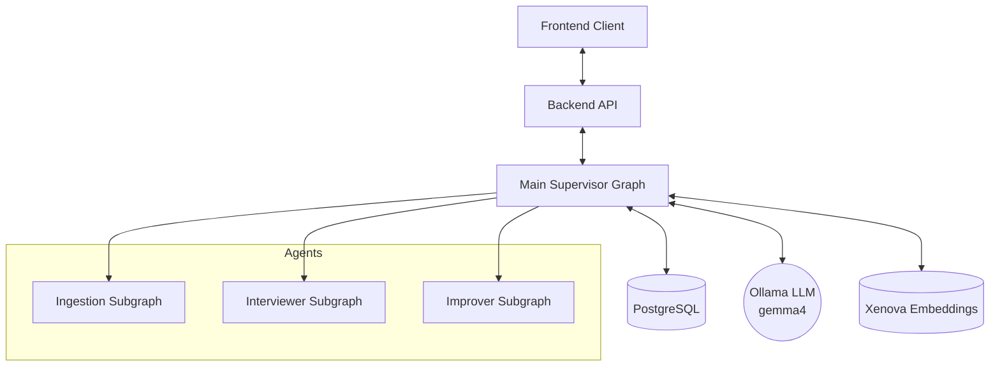

## 2. Main Supervisor LangGraph Topology

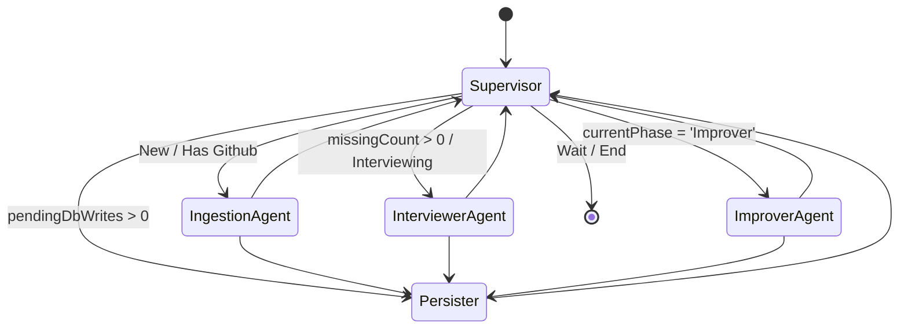

## 3. Supervisor Routing Logic Decision Tree

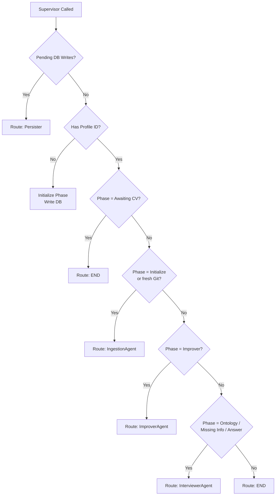

## 4. Ingestion Subgraph Data Flow

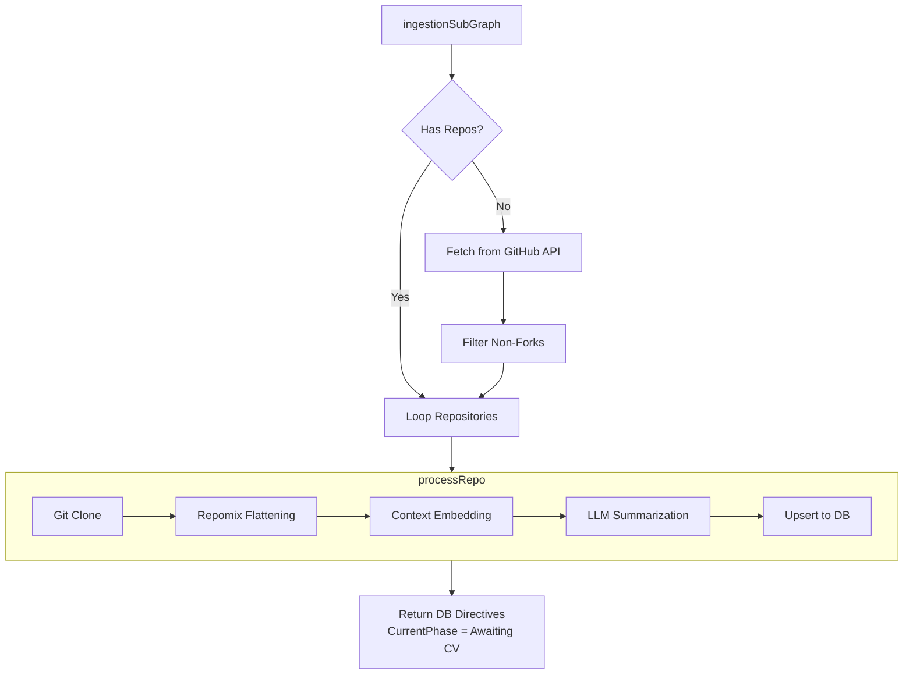

## 5. Embedder Pipeline Sequence

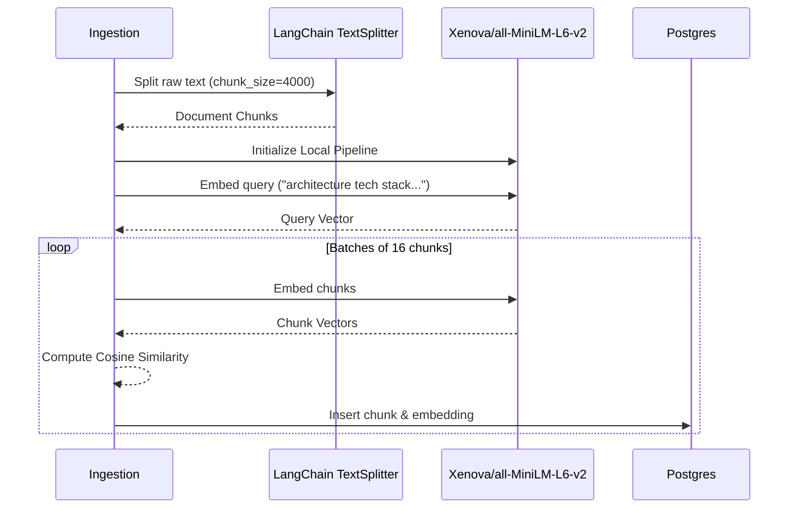

## 6. Ingestion LLM Summarization Flow

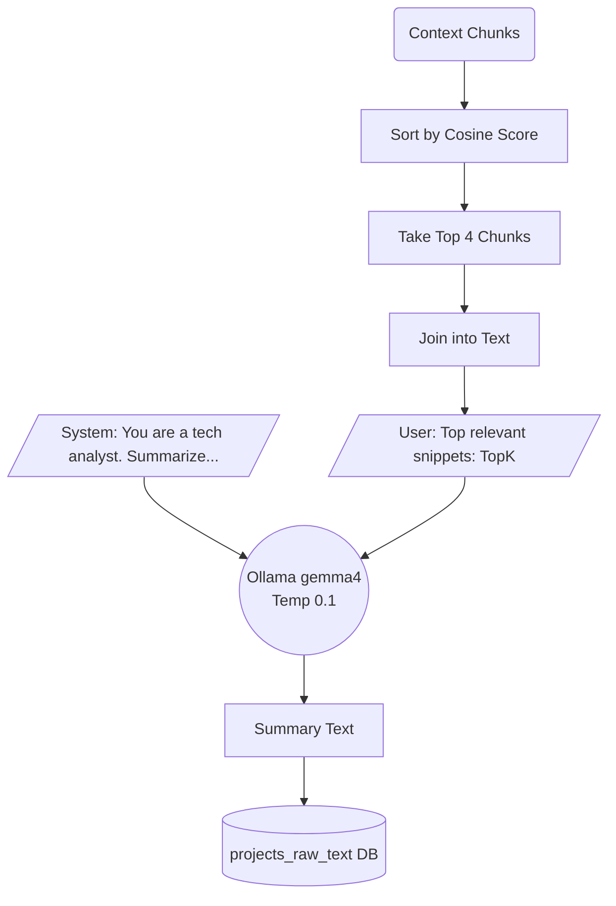

## 7. Interviewer Subgraph Topology

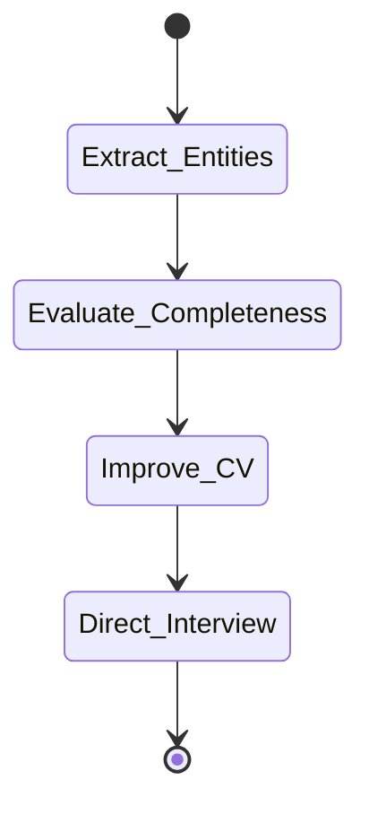

## 8. Interviewer: Entity Extraction (Database Dashboard)

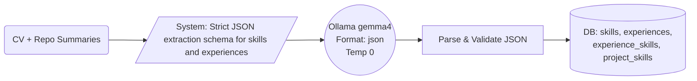

## 9. Interviewer: Structural Completeness Evaluation

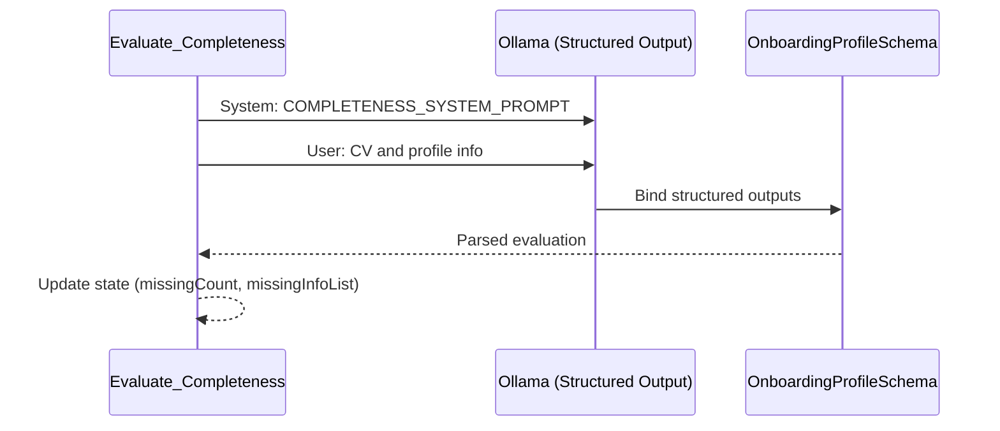

## 10. Interviewer: Direct Interview & Interrupts

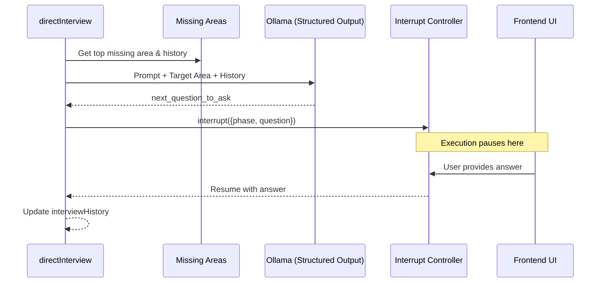

## 11. Interviewer: Master CV Improvement

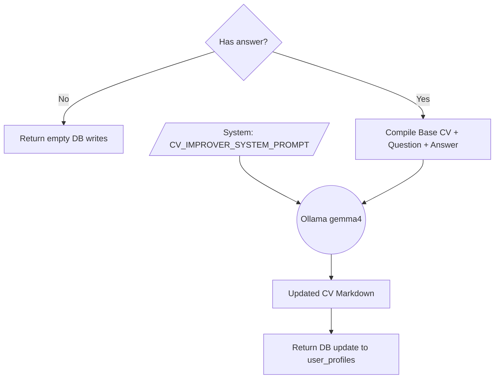

## 12. Improver Subgraph Topology (Critique Fork-Join)

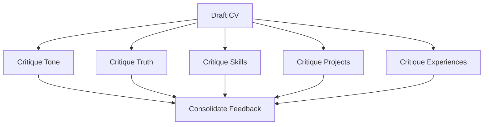

## 13. Improver: Draft CV with Context Tools

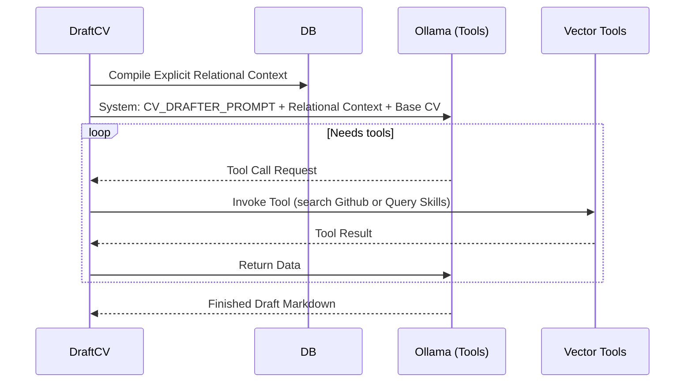

## 14. Vector Tools Sequence

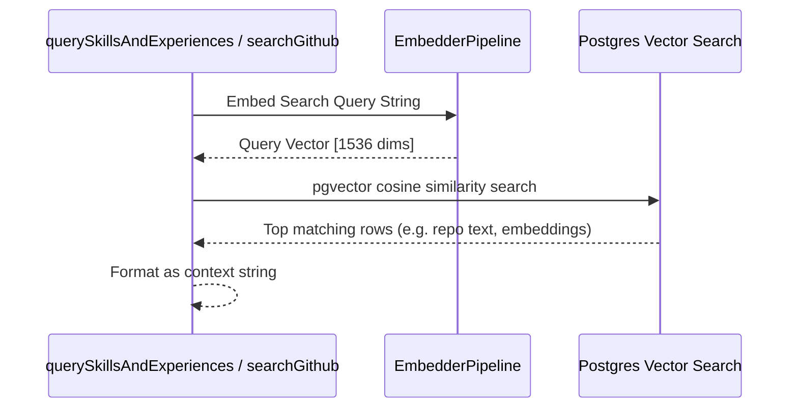

## 15. Improver Critique Loop details

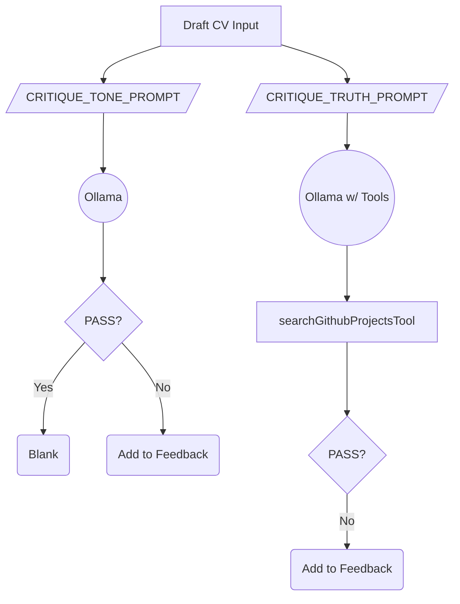

## 16. Improver Consolidation Flow

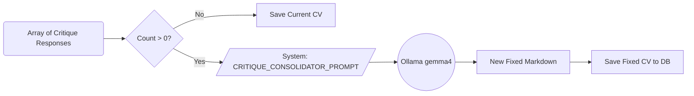

## 17. LangGraph State Object Lifecycle

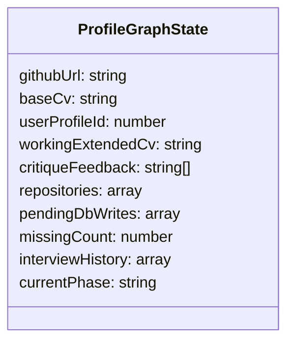

## 18. Persister Execution Path

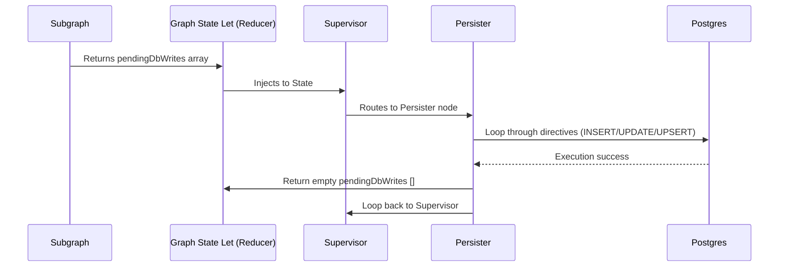

## 19. Relational Entity ERD (Discovered Logic)

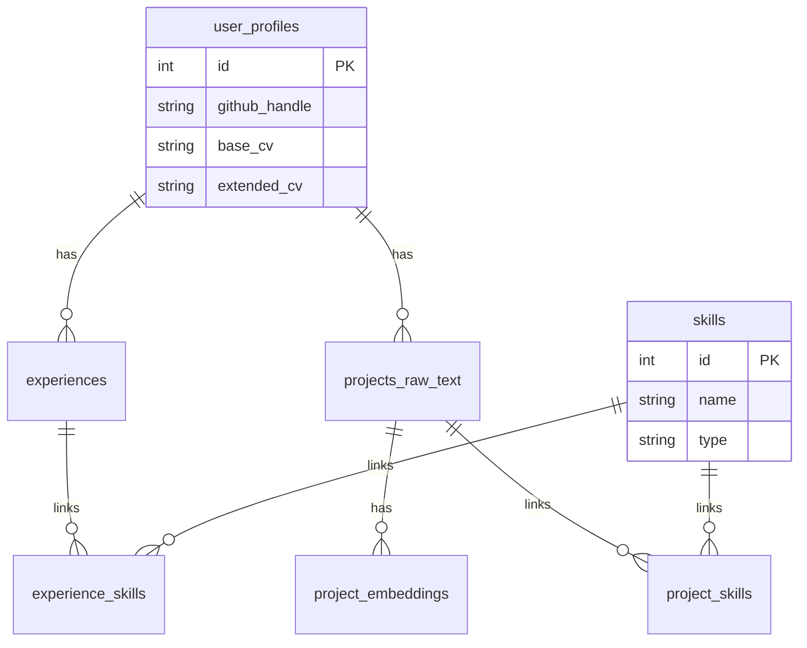

## 20. Total LLM Operations Table

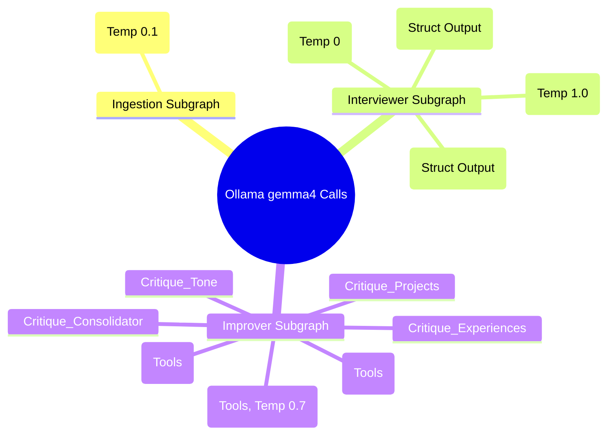
